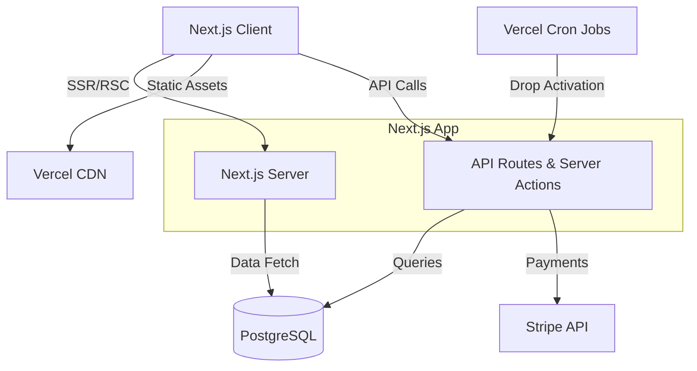

# Design Document

## Overview

The streetwear e-commerce platform is a Next.js 14+ application using the App Router for server-side rendering and optimal performance. The architecture separates concerns into presentation (React components), business logic (server actions and API routes), data access (Prisma ORM), and external services (Stripe for payments, Vercel for hosting).

The system prioritizes mobile-first responsive design, sub-2-second page loads, and conversion optimization. The Drop Engine operates as a specialized subsystem with scheduled jobs and real-time state management. All product data, inventory, and orders are stored in PostgreSQL with atomic transaction guarantees to prevent race conditions during high-traffic drops.

## Architecture

### High-Level Architecture



### Technology Stack

- **Frontend**: Next.js 14+ (App Router), React 18, TypeScript, Tailwind CSS
- **Backend**: Next.js API Routes, Server Actions, Server Components
- **Database**: PostgreSQL with Prisma ORM
- **Payments**: Stripe Checkout and Payment Intents API
- **Authentication**: NextAuth.js with credential and OAuth providers
- **Image Optimization**: Next.js Image component with Vercel Image Optimization
- **Deployment**: Vercel with Edge Functions and CDN
- **Scheduled Jobs**: Vercel Cron for drop activation
- **State Management**: React Server Components (server state), Zustand (client state)
- **Validation**: Zod for schema validation
- **Testing**: Vitest for unit tests, fast-check for property-based testing

### Deployment Architecture

The application deploys to Vercel with the following characteristics:
- Server-side rendering for all product and marketing pages (SEO)
- Static generation for high-traffic pages with ISR (Incremental Static Regeneration)
- Edge functions for geolocation-based features
- CDN caching for images and static assets
- Database connection pooling via Prisma Data Proxy or PgBouncer

## Components and Interfaces

### Core Modules

#### 1. Product Catalog Module

**Responsibilities:**
- Product CRUD operations
- Variant management (size, color combinations)
- Image upload and optimization
- Product search and filtering

**Key Components:**
- `ProductService`: Business logic for product operations
- `ProductRepository`: Data access layer for products
- `VariantRepository`: Data access for product variants
- `ImageUploadService`: Handles image processing and CDN upload

**Interfaces:**

```typescript
interface Product {
  id: string
  name: string
  slug: string
  description: string
  basePrice: number
  images: ProductImage[]
  variants: ProductVariant[]
  category: string
  tags: string[]
  sizeGuide?: string
  createdAt: Date
  updatedAt: Date
}

interface ProductVariant {
  id: string
  productId: string
  sku: string
  size: string
  color: string
  priceAdjustment: number
  inventory: number
  lowStockThreshold: number
}

interface ProductImage {
  id: string
  url: string
  altText: string
  order: number
}
```

#### 2. Drop Engine Module

**Responsibilities:**
- Schedule and manage timed product launches
- Countdown timer logic
- Early access gating
- Drop state transitions (scheduled → live → sold out)

**Key Components:**
- `DropService`: Core drop management logic
- `DropScheduler`: Cron job handler for drop activation
- `EarlyAccessService`: Manages early access eligibility
- `DropRepository`: Data access for drops

**Interfaces:**

```typescript
interface Drop {
  id: string
  productId: string
  launchDate: Date
  earlyAccessDate?: Date
  earlyAccessRules?: EarlyAccessRule[]
  status: 'scheduled' | 'early_access' | 'live' | 'sold_out'
  notificationSent: boolean
  createdAt: Date
}

interface EarlyAccessRule {
  type: 'email_list' | 'previous_customer' | 'vip_tier'
  criteria: Record<string, any>
}
```

#### 3. Inventory Management Module

**Responsibilities:**
- Track stock levels per variant
- Handle inventory reservations during checkout
- Prevent overselling with atomic operations
- Low stock alerts

**Key Components:**
- `InventoryService`: Business logic for inventory operations
- `InventoryRepository`: Data access with transaction support
- `ReservationService`: Temporary inventory holds during checkout

**Interfaces:**

```typescript
interface InventoryOperation {
  variantId: string
  quantity: number
  operation: 'reserve' | 'release' | 'deduct' | 'add'
  orderId?: string
}

interface InventoryReservation {
  id: string
  variantId: string
  quantity: number
  expiresAt: Date
  sessionId: string
}
```

#### 4. Checkout and Payment Module

**Responsibilities:**
- Shopping cart management
- Checkout flow orchestration
- Stripe payment processing
- Order creation and confirmation

**Key Components:**
- `CartService`: Cart operations and validation
- `CheckoutService`: Orchestrates checkout flow
- `PaymentService`: Stripe integration
- `OrderService`: Order creation and management

**Interfaces:**

```typescript
interface Cart {
  id: string
  sessionId: string
  items: CartItem[]
  discountCode?: string
  subtotal: number
  discount: number
  total: number
  expiresAt: Date
}

interface CartItem {
  variantId: string
  quantity: number
  price: number
  reservationId?: string
}

interface Order {
  id: string
  orderNumber: string
  customerId?: string
  email: string
  items: OrderItem[]
  subtotal: number
  discount: number
  shipping: number
  tax: number
  total: number
  status: 'pending' | 'paid' | 'processing' | 'shipped' | 'delivered' | 'cancelled'
  shippingAddress: Address
  paymentIntentId: string
  createdAt: Date
}
```

#### 5. Admin Dashboard Module

**Responsibilities:**
- Product management UI
- Order management and fulfillment
- Discount code creation
- Analytics and reporting

**Key Components:**
- `AdminProductController`: Product CRUD endpoints
- `AdminOrderController`: Order management endpoints
- `AnalyticsService`: Metrics calculation and aggregation
- `DiscountService`: Discount code logic

**Interfaces:**

```typescript
interface DiscountCode {
  id: string
  code: string
  type: 'percentage' | 'fixed'
  value: number
  expiresAt?: Date
  usageLimit?: number
  usageCount: number
  active: boolean
}

interface AnalyticsMetrics {
  period: { start: Date; end: Date }
  revenue: number
  orderCount: number
  averageOrderValue: number
  conversionRate: number
  cartAbandonmentRate: number
  topProducts: ProductSalesData[]
}
```

#### 6. Customer Account Module

**Responsibilities:**
- User authentication and authorization
- Account creation and management
- Order history viewing
- Password reset flow

**Key Components:**
- `AuthService`: Authentication logic with NextAuth.js
- `UserService`: User account operations
- `UserRepository`: Data access for users

**Interfaces:**

```typescript
interface User {
  id: string
  email: string
  passwordHash: string
  firstName?: string
  lastName?: string
  role: 'customer' | 'admin'
  emailVerified: boolean
  createdAt: Date
}

interface UserSession {
  userId: string
  email: string
  role: string
  expiresAt: Date
}
```

## Data Models

### Database Schema

```prisma
model Product {
  id          String    @id @default(cuid())
  name        String
  slug        String    @unique
  description String
  basePrice   Decimal   @db.Decimal(10, 2)
  category    String
  tags        String[]
  sizeGuide   String?
  createdAt   DateTime  @default(now())
  updatedAt   DateTime  @updatedAt
  
  images      ProductImage[]
  variants    ProductVariant[]
  reviews     Review[]
  drop        Drop?
}

model ProductVariant {
  id                String   @id @default(cuid())
  productId         String
  sku               String   @unique
  size              String
  color             String
  priceAdjustment   Decimal  @db.Decimal(10, 2) @default(0)
  inventory         Int
  lowStockThreshold Int      @default(5)
  
  product           Product  @relation(fields: [productId], references: [id])
  cartItems         CartItem[]
  orderItems        OrderItem[]
  reservations      InventoryReservation[]
  
  @@index([productId])
}

model ProductImage {
  id        String  @id @default(cuid())
  productId String
  url       String
  altText   String
  order     Int
  
  product   Product @relation(fields: [productId], references: [id])
  
  @@index([productId])
}

model Drop {
  id                String   @id @default(cuid())
  productId         String   @unique
  launchDate        DateTime
  earlyAccessDate   DateTime?
  earlyAccessRules  Json?
  status            String   @default("scheduled")
  notificationSent  Boolean  @default(false)
  createdAt         DateTime @default(now())
  
  product           Product  @relation(fields: [productId], references: [id])
  
  @@index([launchDate])
  @@index([status])
}

model Cart {
  id           String     @id @default(cuid())
  sessionId    String     @unique
  discountCode String?
  expiresAt    DateTime
  createdAt    DateTime   @default(now())
  updatedAt    DateTime   @updatedAt
  
  items        CartItem[]
  discount     Discount?  @relation(fields: [discountCode], references: [code])
}

model CartItem {
  id         String         @id @default(cuid())
  cartId     String
  variantId  String
  quantity   Int
  price      Decimal        @db.Decimal(10, 2)
  
  cart       Cart           @relation(fields: [cartId], references: [id])
  variant    ProductVariant @relation(fields: [variantId], references: [id])
  
  @@index([cartId])
  @@index([variantId])
}

model InventoryReservation {
  id        String         @id @default(cuid())
  variantId String
  quantity  Int
  sessionId String
  expiresAt DateTime
  createdAt DateTime       @default(now())
  
  variant   ProductVariant @relation(fields: [variantId], references: [id])
  
  @@index([variantId])
  @@index([expiresAt])
}

model Order {
  id              String      @id @default(cuid())
  orderNumber     String      @unique
  customerId      String?
  email           String
  subtotal        Decimal     @db.Decimal(10, 2)
  discount        Decimal     @db.Decimal(10, 2) @default(0)
  shipping        Decimal     @db.Decimal(10, 2)
  tax             Decimal     @db.Decimal(10, 2)
  total           Decimal     @db.Decimal(10, 2)
  status          String      @default("pending")
  shippingAddress Json
  paymentIntentId String
  createdAt       DateTime    @default(now())
  updatedAt       DateTime    @updatedAt
  
  customer        User?       @relation(fields: [customerId], references: [id])
  items           OrderItem[]
  
  @@index([customerId])
  @@index([status])
  @@index([createdAt])
}

model OrderItem {
  id        String         @id @default(cuid())
  orderId   String
  variantId String
  quantity  Int
  price     Decimal        @db.Decimal(10, 2)
  
  order     Order          @relation(fields: [orderId], references: [id])
  variant   ProductVariant @relation(fields: [variantId], references: [id])
  
  @@index([orderId])
}

model Discount {
  id         String   @id @default(cuid())
  code       String   @unique
  type       String
  value      Decimal  @db.Decimal(10, 2)
  expiresAt  DateTime?
  usageLimit Int?
  usageCount Int      @default(0)
  active     Boolean  @default(true)
  createdAt  DateTime @default(now())
  
  carts      Cart[]
}

model User {
  id            String   @id @default(cuid())
  email         String   @unique
  passwordHash  String
  firstName     String?
  lastName      String?
  role          String   @default("customer")
  emailVerified Boolean  @default(false)
  createdAt     DateTime @default(now())
  updatedAt     DateTime @updatedAt
  
  orders        Order[]
  reviews       Review[]
}

model Review {
  id        String   @id @default(cuid())
  productId String
  userId    String
  rating    Int
  title     String
  comment   String
  verified  Boolean  @default(false)
  createdAt DateTime @default(now())
  
  product   Product  @relation(fields: [productId], references: [id])
  user      User     @relation(fields: [userId], references: [id])
  
  @@index([productId])
  @@index([userId])
}
```

### Key Relationships

- Products have many Variants (one-to-many)
- Products have one Drop (one-to-one, optional)
- Variants have many Reservations (one-to-many)
- Orders have many OrderItems (one-to-many)
- Users have many Orders (one-to-many)
- Carts have many CartItems (one-to-many)

## Correctness Properties

*A property is a characteristic or behavior that should hold true across all valid executions of a system—essentially, a formal statement about what the system should do. Properties serve as the bridge between human-readable specifications and machine-verifiable correctness guarantees.*


### Product Display Properties

**Property 1: Product page completeness**
*For any* product with variants, rendering the product page should include product images, description, base price, and all available variants.
**Validates: Requirements 1.1**

**Property 2: Variant selection updates display**
*For any* product with multiple variants, selecting different variants should produce different price and stock availability values corresponding to each variant's data.
**Validates: Requirements 1.2**

**Property 3: Size guide display**
*For any* product with a size guide, rendering the product page should include the size guide content.
**Validates: Requirements 1.3**

**Property 4: Reviews display**
*For any* product with reviews, rendering the product page should include all reviews with their ratings.
**Validates: Requirements 1.4**

### Cart and Checkout Properties

**Property 5: Adding to cart creates reservation**
*For any* available product variant and valid quantity, adding to cart should create an inventory reservation with the correct variant ID and quantity.
**Validates: Requirements 2.1**

**Property 6: Cart total calculation**
*For any* cart with items, the cart total should equal the sum of (item price × quantity) for all items, minus any applicable discount.
**Validates: Requirements 2.1**

**Property 7: Successful payment creates order and deducts inventory**
*For any* cart with reserved inventory, completing payment successfully should create an order record and deduct the reserved quantities from variant inventory.
**Validates: Requirements 2.4**

**Property 8: Failed payment releases reservations**
*For any* cart with reserved inventory, a failed payment should release all inventory reservations associated with that cart.
**Validates: Requirements 2.5**

### Drop Engine Properties

**Property 9: Countdown calculation accuracy**
*For any* scheduled drop with a future launch date, the countdown should equal the time difference between the current time and the launch date.
**Validates: Requirements 3.1**

**Property 10: Drop state transition at launch**
*For any* drop where the current time equals or exceeds the launch date, the drop status should transition from 'scheduled' to 'live'.
**Validates: Requirements 3.2**

**Property 11: Early access control**
*For any* drop with early access configured, eligible customers should have purchase access before the public launch time, while non-eligible customers should not.
**Validates: Requirements 3.3, 3.4**

**Property 12: Sold out status on zero inventory**
*For any* product variant, when inventory reaches zero, the variant should be marked as out of stock and prevent further purchases.
**Validates: Requirements 3.5, 4.5**

### Product Management Properties

**Property 13: Product creation completeness**
*For any* valid product data including details, images, and variants, creating a product should store all provided data and make it retrievable.
**Validates: Requirements 4.1**

**Property 14: Inventory update immediacy**
*For any* product variant, updating its inventory should make the new stock level immediately visible in subsequent queries.
**Validates: Requirements 4.2**

**Property 15: Variant independence**
*For any* product with multiple variants, each variant should have independent inventory tracking such that changes to one variant's inventory do not affect others.
**Validates: Requirements 4.3**

**Property 16: Image optimization output**
*For any* uploaded product image, the optimization process should produce images in modern formats (WebP, AVIF) with multiple responsive sizes.
**Validates: Requirements 4.4**

### Drop Management Properties

**Property 17: Drop configuration persistence**
*For any* valid drop configuration including launch date and optional early access rules, creating a drop should store all provided data and make it retrievable.
**Validates: Requirements 5.1, 5.2**

**Property 18: Drop activation timing**
*For any* drop configuration, the drop should become active (countdown starts, access controls apply) at the specified time.
**Validates: Requirements 5.3**

**Property 19: Drop update propagation**
*For any* existing drop, updating its configuration should make the changes immediately visible in subsequent queries.
**Validates: Requirements 5.4**

**Property 20: Drop launch state transition**
*For any* drop, when the launch time arrives, the drop should automatically transition from 'scheduled' or 'early_access' to 'live' status.
**Validates: Requirements 5.5**

### Order Management Properties

**Property 21: Order data completeness**
*For any* order, querying order details should return all order information including items, quantities, prices, shipping address, and payment status.
**Validates: Requirements 6.1, 6.2**

**Property 22: Order status update tracking**
*For any* order, updating its status should record the new status with a timestamp reflecting when the change occurred.
**Validates: Requirements 6.3**

**Property 23: Order search accuracy**
*For any* search criteria (customer name, order number, or date range), the search results should include all and only orders matching those criteria.
**Validates: Requirements 6.4**

**Property 24: Order confirmation email**
*For any* newly created order, the system should call the email service with the customer's email and complete order details.
**Validates: Requirements 6.5**

### Discount Properties

**Property 25: Discount code creation**
*For any* valid discount configuration (code, type, value, expiration), creating a discount should store all provided data and make it retrievable.
**Validates: Requirements 7.1**

**Property 26: Valid discount application**
*For any* cart and valid (non-expired, under usage limit) discount code, applying the discount should reduce the cart total by the correct amount based on discount type and value.
**Validates: Requirements 7.2**

**Property 27: Expired discount rejection**
*For any* discount code where the current time exceeds the expiration date, applying the code should be rejected with an error.
**Validates: Requirements 7.3**

**Property 28: Invalid discount rejection**
*For any* discount code that does not exist in the system, applying the code should be rejected with an error.
**Validates: Requirements 7.4**

**Property 29: Usage limit enforcement**
*For any* discount code with a usage limit, when the usage count equals the limit, further applications should be rejected.
**Validates: Requirements 7.5**

### Analytics Properties

**Property 30: Revenue metrics calculation**
*For any* time period and set of orders, the calculated revenue should equal the sum of all order totals within that period, order count should equal the number of orders, and average order value should equal revenue divided by order count.
**Validates: Requirements 8.1**

**Property 31: Product sales aggregation**
*For any* time period, product sales data should correctly aggregate quantities sold and revenue per product from all orders in that period.
**Validates: Requirements 8.2**

**Property 32: Conversion metrics calculation**
*For any* time period, cart abandonment rate should equal (abandoned carts / total carts) and checkout completion rate should equal (completed orders / checkout attempts).
**Validates: Requirements 8.3**

**Property 33: Time range filtering**
*For any* analytics metric and time range, the metric should include only data from orders and events within that time range.
**Validates: Requirements 8.4**

**Property 34: Drop performance metrics**
*For any* drop, sell-through rate should equal (units sold / total units) and time to sell out should equal the duration from launch to when inventory reached zero.
**Validates: Requirements 8.5**

### Performance and SEO Properties

**Property 35: Image optimization attributes**
*For any* product image rendered on a page, the image element should use lazy loading and specify modern formats (WebP, AVIF) as sources.
**Validates: Requirements 9.3**

**Property 36: Structured data presence**
*For any* product page, the rendered HTML should include JSON-LD structured data with product name, price, availability, and image.
**Validates: Requirements 10.1**

**Property 37: Meta tags completeness**
*For any* page, the rendered HTML should include meta tags for title, description, and Open Graph properties (og:title, og:description, og:image).
**Validates: Requirements 10.2, 10.3**

**Property 38: Sitemap completeness**
*For any* set of public pages, the generated sitemap should include URLs for all products, categories, and static pages.
**Validates: Requirements 10.4**

**Property 39: Server-side rendering**
*For any* page request, the initial HTML response should contain the complete page content without requiring client-side JavaScript execution.
**Validates: Requirements 10.5**

### Account Management Properties

**Property 40: User account creation**
*For any* valid email and password, creating an account should store a user record with the email and a hashed (not plaintext) password.
**Validates: Requirements 11.1**

**Property 41: Authentication correctness**
*For any* user account, providing correct credentials should create a session, while incorrect credentials should reject authentication.
**Validates: Requirements 11.2**

**Property 42: Order history isolation**
*For any* logged-in customer, their order history should include all and only orders associated with their user ID.
**Validates: Requirements 11.3**

**Property 43: Order-user association**
*For any* order created by a logged-in customer, the order should be associated with that customer's user ID.
**Validates: Requirements 11.4**

**Property 44: Password reset token generation**
*For any* password reset request, the system should generate a secure reset token and call the email service with the customer's email and reset link.
**Validates: Requirements 11.5**

### Inventory Management Properties

**Property 45: Stock status calculation**
*For any* product variant, the displayed stock status should be 'out of stock' when inventory is zero, 'low stock' when inventory is below the threshold, and 'in stock' otherwise.
**Validates: Requirements 12.1**

**Property 46: Out-of-stock cart prevention**
*For any* product variant with zero inventory, attempting to add it to cart should be rejected with an error.
**Validates: Requirements 12.3**

**Property 47: Concurrent purchase safety**
*For any* product variant, when multiple concurrent operations attempt to reserve or deduct inventory, the final inventory should never be negative and total deductions should not exceed available stock.
**Validates: Requirements 12.4**

**Property 48: Low stock messaging**
*For any* product variant where inventory is below the low stock threshold but above zero, the display should include "Only X left" messaging with the correct quantity.
**Validates: Requirements 12.5**

## Error Handling

### Error Categories

1. **Validation Errors**: Invalid input data (malformed email, negative prices, etc.)
2. **Business Logic Errors**: Operations that violate business rules (adding out-of-stock items, applying expired discounts)
3. **Concurrency Errors**: Race conditions during high-traffic operations (overselling, double-booking)
4. **External Service Errors**: Stripe payment failures, email delivery failures, image upload failures
5. **Database Errors**: Connection failures, constraint violations, transaction deadlocks

### Error Handling Strategy

**Client-Facing Errors:**
- Return user-friendly error messages without exposing internal details
- Use appropriate HTTP status codes (400 for validation, 409 for conflicts, 500 for server errors)
- Include error codes for programmatic handling by frontend
- Log detailed error information server-side for debugging

**Validation:**
- Use Zod schemas for all API inputs and form submissions
- Validate on both client and server (client for UX, server for security)
- Return specific field-level errors for form validation

**Concurrency Control:**
- Use database transactions with appropriate isolation levels
- Implement optimistic locking for inventory updates
- Use atomic operations (e.g., `UPDATE ... WHERE inventory >= quantity`) for reservations
- Retry transient failures with exponential backoff

**External Service Failures:**
- Implement circuit breakers for Stripe and email services
- Queue failed email sends for retry
- Provide fallback behavior (e.g., manual order confirmation if email fails)
- Log all external service errors for monitoring

**Drop Surge Protection:**
- Implement rate limiting on add-to-cart and checkout endpoints
- Use queue system for high-traffic drop launches
- Cache product and inventory data with short TTL during drops
- Monitor and auto-scale database connections

## Testing Strategy

### Unit Testing

Unit tests verify specific functions and components in isolation:

- **Service layer functions**: Test business logic without database
- **Validation functions**: Test Zod schemas with valid and invalid inputs
- **Calculation functions**: Test cart totals, discounts, analytics calculations
- **Utility functions**: Test date formatting, slug generation, etc.
- **React components**: Test rendering and user interactions with React Testing Library

**Framework**: Vitest with React Testing Library for component tests

**Coverage targets**: 80% line coverage for service and utility code

### Property-Based Testing

Property-based tests verify universal properties across many randomly generated inputs:

- **Library**: fast-check for TypeScript/JavaScript
- **Configuration**: Minimum 100 iterations per property test
- **Tagging**: Each property test must include a comment with format: `// Feature: streetwear-ecommerce, Property X: [property description]`
- **Mapping**: Each correctness property in this design document must have exactly one corresponding property-based test

**Key property tests:**
- Cart total calculations with random items and discounts
- Inventory operations with concurrent modifications
- Drop state transitions with various time scenarios
- Discount validation with random expiration dates and usage counts
- Analytics calculations with random order data
- Search and filter operations with random datasets

**Generator strategy:**
- Create smart generators that produce valid domain objects (products, orders, users)
- Include edge cases in generators (zero inventory, expired dates, boundary values)
- Use shrinking to find minimal failing examples when tests fail

### Integration Testing

Integration tests verify interactions between components:

- **Database operations**: Test repositories with real database (test container)
- **API endpoints**: Test full request/response cycle with test database
- **Stripe integration**: Test with Stripe test mode and webhook handling
- **Email service**: Test with email service mock or test mode

**Framework**: Vitest with test database setup/teardown

### End-to-End Testing

E2E tests verify complete user flows:

- Product browsing and variant selection
- Add to cart and checkout flow
- Drop countdown and purchase at launch
- Admin product and order management
- User account creation and login

**Framework**: Playwright for browser automation

**Scope**: Critical user paths only (not comprehensive coverage)

### Performance Testing

- **Lighthouse CI**: Automated performance scoring on each deployment
- **Load testing**: Simulate drop surge traffic with k6 or Artillery
- **Database query analysis**: Monitor slow queries with Prisma logging
- **Real user monitoring**: Track Core Web Vitals in production

## Security Considerations

### Authentication and Authorization

- Passwords hashed with bcrypt (cost factor 12)
- Session tokens stored in httpOnly, secure, sameSite cookies
- CSRF protection via Next.js built-in middleware
- Role-based access control (customer vs admin)
- Admin routes protected with middleware checks

### Payment Security

- Never store credit card numbers (use Stripe tokens)
- PCI compliance through Stripe Checkout
- Webhook signature verification for Stripe events
- HTTPS enforced for all connections

### Data Protection

- Input sanitization to prevent XSS
- Parameterized queries to prevent SQL injection (Prisma handles this)
- Rate limiting on authentication endpoints
- Environment variables for secrets (never committed)

### Inventory Protection

- Atomic database operations for inventory updates
- Reservation expiration to prevent indefinite holds
- Transaction isolation to prevent race conditions
- Audit logging for inventory changes

## Deployment and Infrastructure

### Hosting

- **Platform**: Vercel for Next.js application
- **Database**: PostgreSQL on Railway, Supabase, or Neon
- **CDN**: Vercel Edge Network for static assets
- **Image hosting**: Vercel Image Optimization or Cloudinary

### Environment Configuration

- **Development**: Local PostgreSQL, Stripe test mode
- **Staging**: Separate database, Stripe test mode, preview deployments
- **Production**: Production database, Stripe live mode, custom domain

### Monitoring and Observability

- **Error tracking**: Sentry for error monitoring
- **Analytics**: Vercel Analytics for performance, Google Analytics for user behavior
- **Logging**: Structured logging with Winston or Pino
- **Uptime monitoring**: Vercel monitoring or external service

### Scheduled Jobs

- **Drop activation**: Vercel Cron to check and activate drops every minute
- **Reservation cleanup**: Cron job to expire old reservations every 5 minutes
- **Analytics aggregation**: Daily job to pre-calculate metrics

### Backup and Recovery

- **Database backups**: Automated daily backups with point-in-time recovery
- **Disaster recovery**: Documented restore procedures
- **Data retention**: Order data retained indefinitely, cart data purged after 30 days

## Future Enhancements

### Phase 2 Features

- Wishlist functionality
- Product recommendations based on browsing history
- Multi-currency support
- International shipping with carrier integration
- Gift cards and store credit
- Loyalty program with points

### Phase 3 Features

- Mobile app (React Native)
- Live chat support
- AR try-on for products
- Subscription boxes
- Influencer affiliate program
- Advanced inventory forecasting

## Appendix

### API Endpoint Summary

**Public API:**
- `GET /api/products` - List products with filtering
- `GET /api/products/[slug]` - Get product details
- `POST /api/cart` - Create or update cart
- `POST /api/checkout` - Initiate checkout
- `POST /api/auth/register` - Create account
- `POST /api/auth/login` - Authenticate user

**Admin API:**
- `POST /api/admin/products` - Create product
- `PUT /api/admin/products/[id]` - Update product
- `GET /api/admin/orders` - List orders
- `PUT /api/admin/orders/[id]` - Update order status
- `POST /api/admin/discounts` - Create discount code
- `GET /api/admin/analytics` - Get analytics data

**Webhooks:**
- `POST /api/webhooks/stripe` - Handle Stripe events

### Database Indexes

Critical indexes for performance:
- `Product.slug` (unique)
- `ProductVariant.sku` (unique)
- `ProductVariant.productId`
- `Drop.launchDate`
- `Drop.status`
- `Order.customerId`
- `Order.status`
- `Order.createdAt`
- `InventoryReservation.expiresAt`
- `User.email` (unique)

### Third-Party Services

- **Stripe**: Payment processing
- **Vercel**: Hosting and CDN
- **PostgreSQL**: Database (Railway/Supabase/Neon)
- **Resend or SendGrid**: Transactional emails
- **Cloudinary** (optional): Image hosting and optimization
- **Sentry**: Error monitoring
